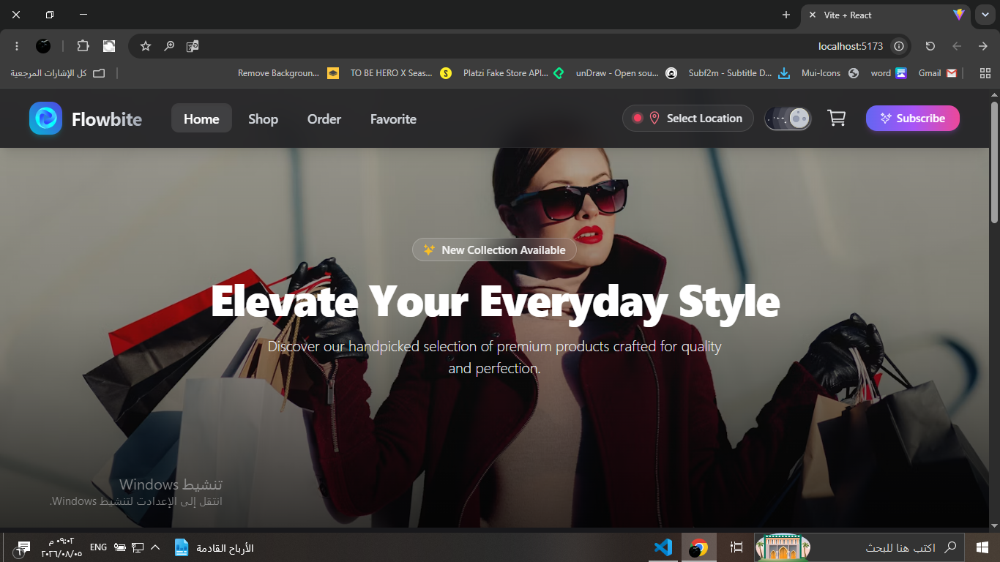
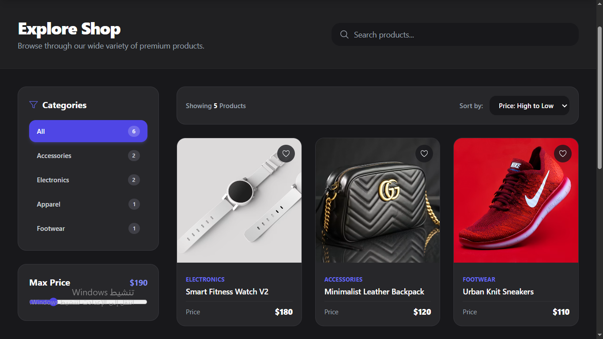
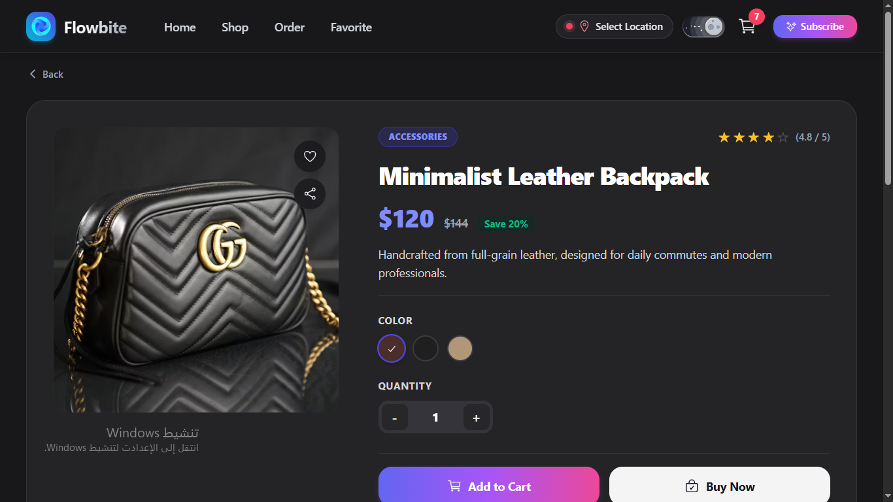
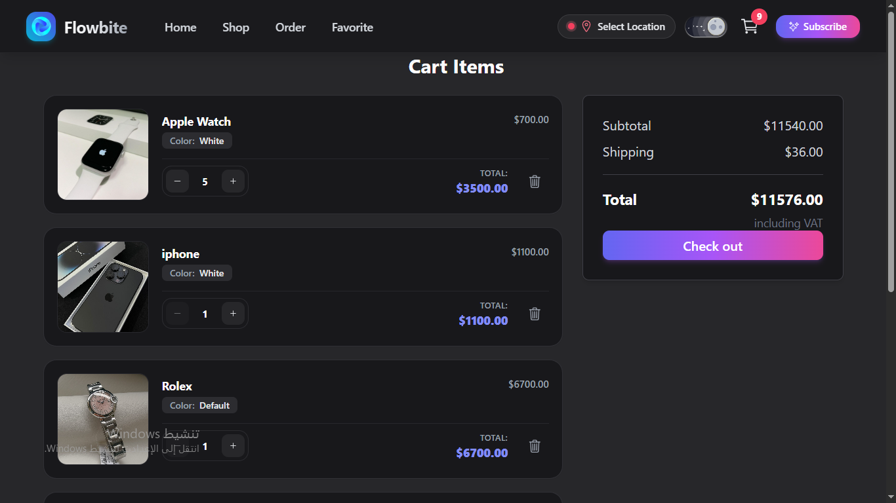
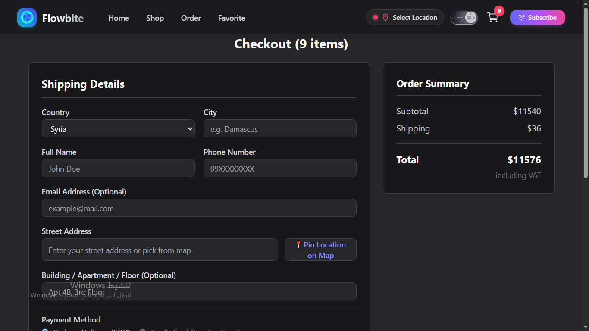
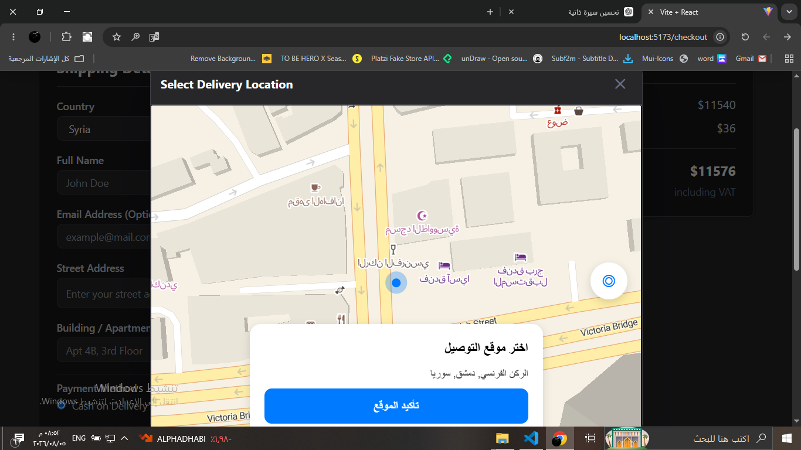
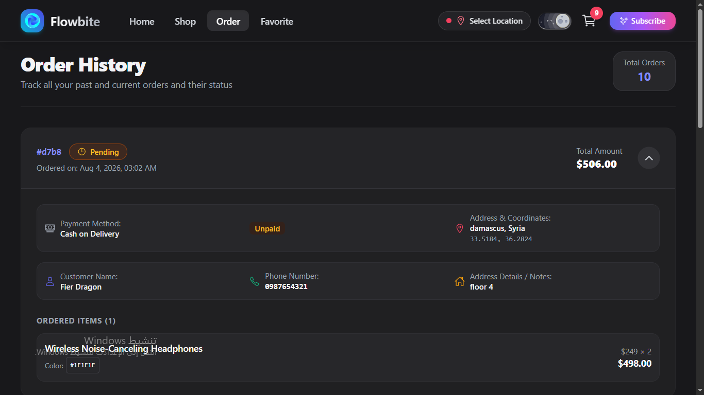

#  React Online Store

A modern and responsive e-commerce web application built with **React**, **TypeScript**, **Vite**, and **Tailwind CSS**.
The project follows **Feature-based Architecture** and demonstrates modern frontend development practices, including state management, form validation, animations, maps integration, and REST API communication.

---

##  Features

* User Authentication
* Product Categories & Filtering
* Product Search
* Product Details
* Shopping Cart
* Wishlist
* Checkout Page
* Interactive Map for Location Selection
* Responsive UI for Mobile, Tablet, and Desktop
* Smooth Animations with Framer Motion
* Mock REST API using JSON Server

---

##  Tech Stack

### Frontend

* React
* TypeScript
* Vite
* Tailwind CSS

### State Management

* Redux

### Form Validation

* Zod

### Routing

* React Router

### API Integration

* Axios
* JSON Server (Mock Backend)

### Maps

* MapLibre GL

### Animations

* Framer Motion

### Architecture

* Feature-based Architecture

---

##  Installation

Clone the repository

```bash
https://github.com/skaepra/React-Online-Store-Only-FrontEnd.git
```

Navigate to the project

```bash
cd React-Online-Store-Only-FrontEnd
```

Install dependencies

```bash
npm install
```

Start the mock backend

```bash
npm run server
```

Run the development server

```bash
npm run dev
```

---

##  Screenshots

### Home



### Shopping List



### Product Details



### Shopping Cart



### Checkout



### Location Selection



### Order



### Sign Up


---


##  Location Services

The checkout page integrates **MapLibre GL** to allow users to select their delivery location directly on the map.

---

## 📱 Responsive Design

The application is fully responsive and optimized for:

* Desktop
* Tablet
* Mobile

---

##  Future Improvements

* Real Backend Integration
* Online Payment Gateway
* User Order History
* Product Reviews
* Admin Dashboard

---

##  Author

**Ahmad Abo Al Shaar**

GitHub:
https://github.com/skaepra
